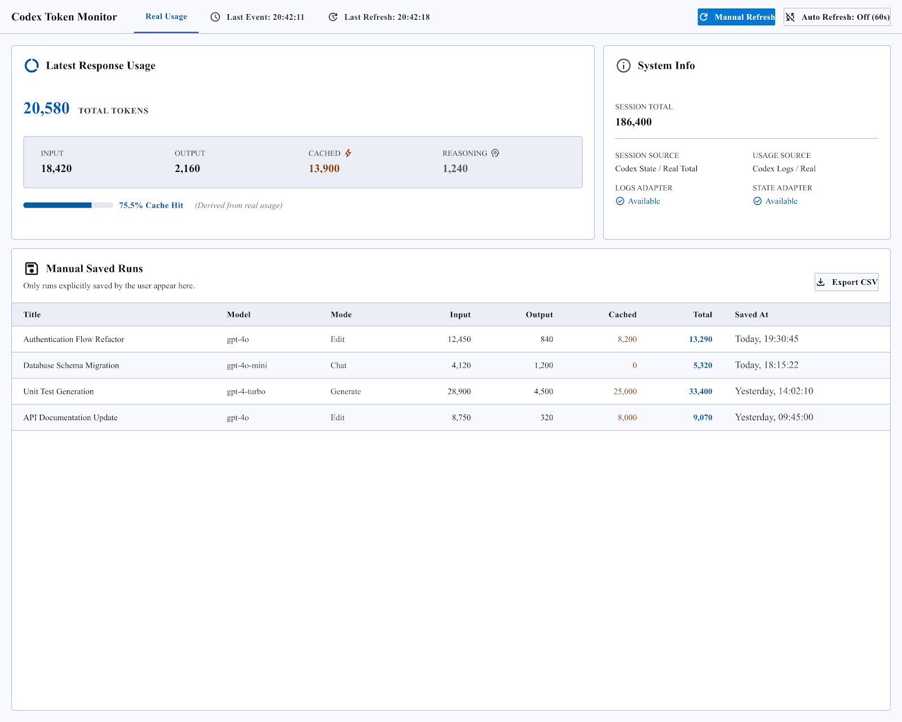
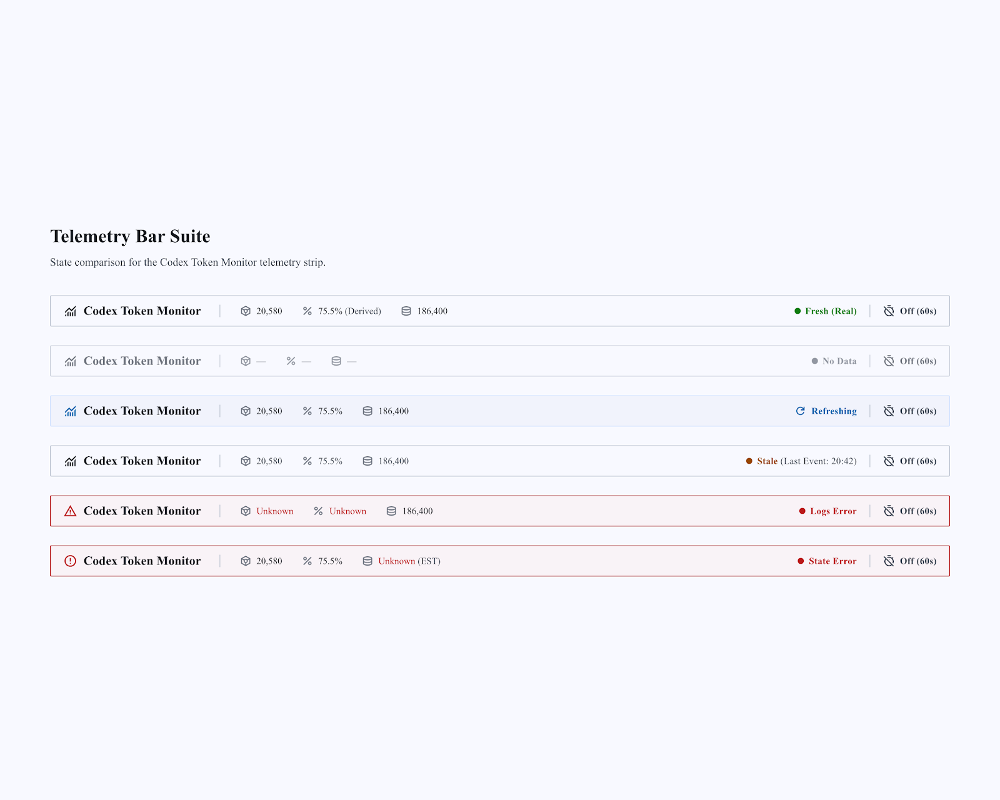

# Codex Token Monitor 设计合同

本文件是 Phase 2.5-UI-A/A2 的唯一设计合同。当前运行时数据合同优先；本合同只冻结视觉层级、状态表达和桌面 View 翻译边界。

## 产品定位

Codex Token Monitor 是 Windows 本地 token usage 监控工具：现代、克制、低干扰且高信息密度。View 层使用 CustomTkinter，表格保留 `ttk.Treeview`；它不是 SaaS 后台、不是完整 Codex 工作台，也不模仿 Reasonix。

## 冻结参考

- Dashboard 图片只作为正常 `Real Usage` 状态的视觉参考。
- telemetry 图片只作为状态栏结构和状态表达参考。
- 其他状态从下文状态矩阵在同一 Dashboard 布局中派生，不参考已丢弃页面。
- 图片中的数据完全虚构，不得进入运行时默认数据。
- 参考图中的导出按钮文案不是实现合同；现有操作固定为 `Export Report`，报告格式为 Markdown。

## Design Tokens

| 角色 | 冻结规则 |
| --- | --- |
| Primary font | Segoe UI |
| Fallback | system Tk default |
| Spacing grid | 4px |
| Common spacing | 4 / 8 / 12 / 16 / 24 |
| Visual corner radius | 8–12px |
| Border | 1px low-contrast border |
| Shadow | none or minimal |
| Gradient | prohibited |
| Glass effect | prohibited |
| Animation | prohibited for this phase |

颜色按语义角色集中定义，而不是复制网页色值：window background、surface、raised surface、border、primary text、secondary text、accent、real/fresh、estimate/warning、stale、error、unknown/disabled。所有状态必须同时使用文字与颜色；颜色从不单独表达状态。

## Dashboard 信息层级

1. 顶部状态与操作区：`Codex Token Monitor`、当前数据状态、Last Event、Last Refresh、Manual Refresh、`Auto Refresh: On/Off (60s)`。
2. 第一层级：Latest Response Usage；Total Tokens 适度突出；Input、Output、Total、Cached、Reasoning、Cache Hit 横向可比较；同时显示 `Derived from real usage` 或 estimate 说明。
3. 第二层级：Session Total、Usage Source、Session Source、Logs Adapter、State Adapter、时间与 freshness。
4. 第三层级：Manual Saved Runs，以及手工 Run 输入、保存和报告功能。

不采用固定宽度的大型导航区域；内容使用可扩展网格。

## 文案与 Manual Saved Runs

产品名称只能是 `Codex Token Monitor`。手工记录区标题固定为 `Manual Saved Runs`，并显示：

> Only runs explicitly saved by the user appear here.

建议列为 Title、Model、Mode、Input、Output、Cached、Total、Saved At。最终实现必须以当前 `AgentRun` 数据模型为准；不得为了匹配图片新增字段。

## Dashboard 状态矩阵

所有状态共享同一 Dashboard 布局，不能生成完全不同的页面。

| 状态 | 数据与显示合同 | 可用操作 |
| --- | --- | --- |
| Real Usage | 真实数值可用；显示来源与时间，并标记 `Real Usage`。 | Manual Refresh；Auto Refresh On/Off。 |
| Estimate | 显示 `Local Estimate`，不得伪装成真实 usage。 | Manual Refresh；Auto Refresh On/Off。 |
| No Data / Unknown | 数值显示 `—` 或 `Unknown`，绝不显示为 0。显示 `No response usage is available yet.` 与 `Use Manual Refresh or wait for Codex usage data.`；无数据不等于 adapter error。 | Manual Refresh；Auto Refresh On/Off。 |
| Refreshing | 保留旧值；顶部只显示一次 `Refreshing…`，并显示 `Previous values remain visible while new usage is loaded.`；保持防重叠刷新合同。 | 不重复触发刷新；Auto Refresh 状态可见。 |
| Stale | 保留旧值并标记 `Stale Data`；显示 Last Event 与 Manual Refresh。不定义固定 stale 时长阈值。 | Manual Refresh；Auto Refresh On/Off。 |
| Logs Adapter Error | logs usage 指标为 Unknown，或保留旧值并标记 Stale；若 state 可用，Session Total 仍可显示。 | Manual Refresh；不提供额外连接操作。 |
| State Adapter Error | 若 logs 可用，Latest Response Usage 继续显示；Session Total 为 Unknown 或当前真实存在的 estimate 回退，且明确显示 Session Source。 | Manual Refresh；不提供额外连接操作。 |
| Auto Refresh Off | 正常状态，不是错误；显示 `Auto Refresh: Off (60s)`。 | Manual Refresh 可用。 |
| Auto Refresh On | 显示 `Auto Refresh: On (60s)`；使用克制的活动状态，不改变 60 秒合同。 | Manual Refresh 可用。 |

## telemetry bar 合同

字段顺序固定为：

1. Codex Token Monitor
2. Current Total
3. Cache Hit
4. Session Total
5. Data Status
6. Auto Refresh

所有状态保持相同高度、字段顺序、基本宽度与数字对齐；只改变状态文字、缺失值和克制的提示色。至少支持 `Fresh · Real`、`No Data`、`Refreshing`、`Stale`、`Logs Error`、`State Error`。不在 telemetry bar 复制 Dashboard 的全部 adapter 技术字段。

## 窗口与缩放

- Reference size：约 1180×760。
- Minimum size：约 980×660。
- 核心 token 数值在最小尺寸仍可读。
- 区域使用合理的 grid 权重扩展；Manual Saved Runs 可纵向扩展。
- telemetry bar 保持固定且紧凑的高度。
- 不依赖网页响应式布局。

## 桌面 View 翻译边界

CustomTkinter 是唯一允许的轻量第三方 View 层依赖；卡片、按钮、输入、开关、分段标签和主要容器优先使用其原生组件。`ttk.Treeview` 可继续承担表格，集中式 `ttk.Style` 只用于统一表格外观。

不得复制 HTML/CSS/JavaScript；不得改用 Electron、WebView、Qt、React 或浏览器 UI；不得引入其他第三方 UI 框架；不得以复杂 Canvas 模拟网页视觉；不得使用毛玻璃、阴影动画或渐变。数据、adapter、storage、refresh、report 与 presenter 合同保持不变，参考图中的虚构数据不得进入运行时。
